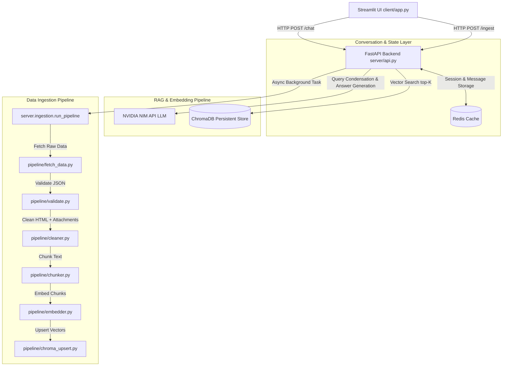

# Confluence RAG Chatbot

A Retrieval-Augmented Generation (RAG) chatbot that ingests Confluence content, converts it into vector embeddings, stores those embeddings in ChromaDB, and answers user questions via a Streamlit UI backed by a FastAPI backend.

This README documents the entire platform, including every core function, module, and workflow from ingestion through chat.

---

## 🧠 What this Platform Does

The system is built to:
- Ingest content from Atlassian Confluence spaces
- Clean and normalize page bodies, attachments, and comments
- Split content into overlapping semantic chunks
- Convert chunks into embeddings using NVIDIA's NV Embed QA model
- Store embeddings and metadata in user-level ChromaDB collections
- Accept user chat queries in Streamlit
- Retrieve relevant chunks from Chroma
- Build a grounded prompt and query the NVIDIA LLM
- Stream back answers with source citations
- Persist session history in Redis for multi-turn conversations

---

## 🏗️ Architecture Overview



### Layer Walkthrough

1. **Frontend**: `client/app.py`
   - Provides a Streamlit-based chat interface.
   - Supports multiple sessions, ingestion controls, and source links.

2. **Backend API**: `server/api.py`
   - Exposes endpoints for chat, ingestion, session management, and ingest job status.
   - Orchestrates RAG prompt construction and answer generation.

3. **Session Storage**: `server/redis_service.py`
   - Stores history in Redis if available.
   - Uses TTL-based expiration and supports session listing.

4. **Ingestion Pipeline**: `server/ingestion.py`
   - Coordinates data fetching, validation, cleaning, chunking, embedding, and Chroma upsert.

5. **Vector Store**: `pipeline/chroma_upsert.py`
   - Persists vectors to ChromaDB per user.

6. **Retrieval and Generation**: `server/api.py` + `server/prompts.py`
   - Condenses follow-up queries.
   - Retrieves top matching chunks.
   - Builds grounded prompts.
   - Calls the NVIDIA LLM.

---

## ⚡ Prerequisites

- Python 3.10+
- NVIDIA NIM API key (`NVIDIA_API_KEY`)
- Optional Redis or Upstash Redis credentials
- Confluence account email and API token

---

## 🛠️ Setup & Configuration

1. Clone repository and install dependencies:

```bash
git clone <repo-url>
cd Confluence-Chatbot
python -m venv venv
.\venv\Scripts\Activate.ps1
pip install -r requirements.txt
```

2. Create `.env` in the project root:

```ini
NVIDIA_API_KEY=nvapi-your-key
EMBEDDING_MODEL=nvidia/nv-embedqa-e5-v5
LLM_MODEL=nvidia/mistral-nemo-12b-instruct
BACKEND_URL=http://127.0.0.1:8000
UPSTASH_REDIS_URL=redis://... if used
UPSTASH_REDIS_TOKEN=...
```

3. Start services:

```bash
uvicorn server.api:app --reload --host 127.0.0.1 --port 8000
streamlit run client/app.py
```

---

## 📡 API Endpoints

| Endpoint | Method | Purpose |
|---|---|---|
| `/` | GET | Health check |
| `/health` | GET | Status check |
| `/chat` | POST | Synchronous chat request |
| `/chat/stream` | POST | Streamed chat response |
| `/ingest` | POST | Trigger ingestion job |
| `/ingest/status/{job_id}` | GET | Ingestion progress |
| `/sessions/{user_id}` | GET | List sessions for user |
| `/sessions/{user_id}/{session_id}` | GET | Load session history |
| `/sessions/{user_id}/{session_id}` | DELETE | Delete session |
| `/sessions/{session_id}/clear` | POST | Clear session history |

### Example `/chat` request

```json
{
  "user_id": "demo-user",
  "query": "What is the platform architecture?",
  "session_id": "optional-session-id"
}
```

### Example `/ingest` request

```json
{
  "user_id": "demo-user",
  "api_key": "YOUR_CONFLUENCE_API_TOKEN",
  "user_email": "user@example.com",
  "confluence_url": "https://your-instance.atlassian.net/wiki",
  "label": "optional-label",
  "title": "optional-title"
}
```

---

## 📂 File-by-File Explanation

### `client/app.py`

A Streamlit application that:
- Maintains UI state in `st.session_state`.
- Offers user ID and session selection.
- Provides Confluence credential and filter input.
- Triggers ingestion and polls job status.
- Sends chat queries to `/chat/stream`.
- Renders streamed assistant text and clickable source links.

Key functions:

- `get_history(user_id)`
  - Returns the current in-memory chat history for a given user.

- `refresh_sessions(user_id)`
  - Fetches session IDs from the backend.
  - Merges them with locally known sessions.

- `load_session_history(user_id, session_id)`
  - Loads the message history for a specific session from the backend.

- `source_href(src, confluence_base_url)`
  - Builds a URL for a source item.
  - Handles absolute URLs, relative URLs, and page IDs.

- `render_sources(sources, confluence_base_url)`
  - Renders source links under assistant messages.

- `stream_chat_response(payload, metadata, status_slot=None)`
  - Opens a streaming POST to `/chat/stream`.
  - Handles `status`, `session`, `token`, `metadata`, and `error` events.
  - Yields answer tokens to Streamlit.

UI behavior:
- Sidebar contains ingestion controls, session selector, and clear history button.
- Main panel shows the conversation and chat input.
- When a query is submitted, the assistant response is streamed live.

---

### `server/api.py`

The backend entrypoint that coordinates ingestion, chat, retrieval, and session state.

#### Data models
- `SourceItem` describes a citation with `title`, `url`, and `page_id`.
- `ChatRequest` contains `user_id`, `query`, and optional `session_id`.
- `ChatResponse` contains the final answer plus sources.
- `IngestRequest` accepts Confluence credentials and optional filters.

#### Core helpers

- `_first_non_latin1(value)`
  - Returns the first character in a string that cannot be encoded in Latin-1.

- `validate_ingest_request(req)`
  - Validates that `user_id`, `api_key`, `user_email`, and `confluence_url` are provided.
  - Ensures credentials are safe for Basic Auth.
  - Validates `confluence_url` format.

- `embed_query(query)`
  - Uses `server.config.embed_with_retries()` to embed the search query.

- `retrieve_chunks(user_id, query, top_k=10)`
  - Loads or creates the user-specific Chroma collection.
  - Embeds the query.
  - Queries Chroma for the top matching chunks.
  - Returns documents and metadata arrays.

- `condense_query(history, current_query)`
  - Compacts follow-up questions into standalone questions.
  - Uses the last 6 conversation turns.
  - Sends a prompt to the NVIDIA LLM.
  - Falls back to the original query if it fails.

- `check_untrusted_instructions(documents)`
  - Scans retrieved chunks for suspicious prompt-injection patterns.
  - Logs any matches.

- `generate_answer(prompt, history)`
  - Sends the final RAG prompt to NVIDIA chat completions.
  - Returns the generated answer text.

- `generate_answer_stream(prompt, history)`
  - Streams partial responses from the model.
  - Yields chunks of answer text.

- `extract_deduped_sources(metadatas)`
  - Normalizes metadata into `SourceItem` objects.
  - Deduplicates sources by `page_id` or `url`.

- `prepare_rag_prompt(user_id, query, history)`
  - Condenses the query.
  - Retrieves the relevant chunks.
  - Builds the full RAG prompt with context and history.
  - Returns a prompt or a fallback error if no context exists.

- `rag_pipeline(user_id, query, history)`
  - Calls `prepare_rag_prompt()` and `generate_answer()`.

#### Endpoints

- `GET /` and `GET /health`
  - Simple health checks.

- `POST /chat`
  - Reuses or creates a session.
  - Loads session history from Redis.
  - Runs the RAG pipeline.
  - Saves user and assistant messages to Redis.
  - Returns a `ChatResponse`.

- `POST /chat/stream`
  - Similar to `/chat` but returns a stream of NDJSON events.
  - Emits session creation, status updates, tokens, and metadata.

- `GET /sessions/{user_id}`
  - Returns a list of session metadata for a user.

- `GET /sessions/{user_id}/{session_id}`
  - Returns messages for one session.

- `DELETE /sessions/{user_id}/{session_id}`
  - Deletes a session and its metadata.

- `POST /sessions/{session_id}/clear`
  - Clears all messages from a session.

- `POST /ingest`
  - Validates the ingest request.
  - Prevents concurrent ingestion jobs for the same user.
  - Creates a job record and schedules `run_pipeline()`.

- `GET /ingest/status/{job_id}`
  - Returns the current ingestion job state.

---

### `server/config.py`

Shared NVIDIA and model configuration.

- `NVIDIA_API_KEY` loaded from `.env`.
- `EMBED_MODEL` and `LLM_MODEL` default values.
- `embedding_collection_suffix()` returns the collection suffix used for user-specific collections.
- `get_nvidia_client()` initializes the NVIDIA OpenAI-compatible client.
- `embed_with_retries(...)` retries embedding requests with exponential backoff.

---

### `server/ingest_jobs.py`

Tracks ingestion jobs using Redis or in-memory fallback.

- `create_ingest_job(user_id)`
  - Creates job metadata including `job_id`, `user_id`, `status`, `stage`, counters, and timestamps.
  - Stores job state in Redis and registers the user's running job.

- `get_running_job(user_id)`
  - Returns the currently running job for a user, if any.

- `get_ingest_job(job_id)`
  - Loads job state by job ID.
  - Marks jobs stale and failed if they have been running longer than 6 hours.

- `update_ingest_job(...)`
  - Updates job stage, status, progress counts, and error messages.
  - Persists the updated job state.

---

### `server/redis_client.py`

Provides Redis connection management.

- `get_redis_client()`
  - Creates an Upstash Redis client from `UPSTASH_REDIS_URL` and `UPSTASH_REDIS_TOKEN`.
  - Tests the connection by calling `ping()`.

- `is_redis_available()`
  - Returns whether Redis is connected.

---

### `server/redis_service.py`

Manages chat sessions and history storage.

- `SESSION_TTL = 7 * 24 * 60 * 60` (seven days)

- `_serialize_message(msg)` / `_deserialize_message(msg_json)`
  - Convert `Message` objects to/from JSON for Redis storage.

- `create_new_session(user_id)`
  - Creates a session UUID and stores metadata in Redis.
  - Adds the session to the user's session set.

- `save_message(...)`
  - Appends a message to a Redis list.
  - Updates session metadata.
  - Refreshes TTL.

- `get_session_history(session_id)`
  - Reads all session messages from Redis and deserializes them.

- `get_user_sessions(user_id)`
  - Reads all session IDs for a user.
  - Loads metadata for each session.
  - Sorts sessions by `updated_at` descending.

- `clear_session_history(session_id)`
  - Deletes the session list and metadata.

- `delete_session(user_id, session_id)`
  - Deletes session data and removes it from the user's session set.

- `update_session_accessed(session_id)`
  - Refreshes `last_accessed_at` in metadata.

---

### `server/models.py`

Pydantic schemas used across the server.

- `Message`
  - Represents a chat message with `role`, `content`, `timestamp`, and optional `sources`.

- `ChatSession`
  - Holds session ID, user ID, messages, and timestamps.

- `SessionMetadata`
  - Metadata returned by session listing endpoints.

- `ClearHistoryRequest`
  - Schema for history clearing requests.

---

### `server/prompts.py`

Contains prompt engineering templates and RAG prompt construction.

- `SYSTEM_PROMPT`
  - A strict safety prompt instructing the LLM to answer only from the provided context.
  - Includes explicit grounding, no hallucination, and instruction-injection protection.

- `CONDENSE_QUERY_PROMPT`
  - Rewrites follow-up questions into standalone questions.

- `build_rag_prompt(query, documents, metadatas, history)`
  - Formats retrieved chunks as context blocks.
  - Adds conversation history.
  - Appends the current question.

---

### `pipeline/fetch_data.py`

Fetches Confluence pages, attachments, and comments.

- `api(base_url, path)`
  - Normalizes URL paths.

- `build_session(user, token)`
  - Creates a `requests.Session` with Basic Auth.

- `get(session, url, params, retries)`
  - Performs HTTP GET with retry on 429 rate limit.

- `paginate(session, url, param, key)`
  - Retrieves paginated results from Confluence APIs.

- `_escape_cql_literal(value)`
  - Escapes values for Confluence CQL queries.

- `fetch_filtered(session, confluence_url, label, title)`
  - Fetches pages by label and/or title.
  - Handles CQL filtering and result cleanup.

- `fetch_all(session, confluence_url)`
  - Fetches all Confluence pages when no filter is provided.

- `fetch_children_recursive(session, confluence_url, page_id, depth, max_depth)`
  - Recursively fetches child pages.

- `fetch_attachments(session, confluence_url, page_id)`
  - Lists attachments for a page.

- `fetch_comments(session, confluence_url, page_id)`
  - Retrieves comments for a page.

- `download_attachment(...)`
  - Downloads attachment bytes with a max size guard.

- `parse_attachment(attachment, content_bytes)`
  - Converts attachments into text.
  - Supports CSV, HTML/text, JSON, PDF, and DOCX.

- `process_attachment(session, confluence_url, page_id, raw_attachment)`
  - Combines attachment download and parsing.

---

### `pipeline/validate.py`

Validates the fetched Confluence payload.

Models:
- `Filter`
- `Ancestor`
- `Attachment`
- `Comment`
- `Page`
- `ConfluenceExport`

Functions:
- `validate_data(raw_data)`
  - Validates the Confluence export and returns normalized JSON.

- `validate_json_file(file_path)`
  - Loads and validates a JSON file.

- `main()`
  - CLI entrypoint for `validateJSON.py`.

---

### `pipeline/cleaner.py`

Cleans Confluence HTML and assembles document text.

- `clean_html(html_text)`
  - Uses BeautifulSoup to strip HTML tags and whitespace.
  - Removes Confluence placeholder tags.

- `build_clean_doc(page)`
  - Converts a page into a clean document dictionary.
  - Includes merged body, attachments, comments, title, URL, and metadata.

- `clean_data(raw_data)`
  - Validates raw data and produces a list of cleaned documents.

- `clean_export(input_path, output_path)`
  - CLI helper that writes cleaned documents to a JSON file.

---

### `pipeline/chunker.py`

Splits cleaned text into overlapping chunks.

Constants:
- `DEFAULT_CHUNK_SIZE = 1000`
- `DEFAULT_CHUNK_OVERLAP = 500`

Functions:
- `build_text_splitter(chunk_size, chunk_overlap)`
  - Creates a `RecursiveCharacterTextSplitter` with separators.

- `make_chunk_id(page_id, chunk_index, chunk_text)`
  - Generates a deterministic chunk ID using SHA-256.

- `is_glossary_document(document)`
  - Detects glossary pages by title or page ID and enables debug logs.

- `chunk_document(document, splitter, user_id, connection_id)`
  - Splits a single document into chunks.
  - Attaches metadata including `page_id`, `page_title`, `url`, and `chunk_index`.

- `chunk_data(clean_documents, user_id, connection_id, chunk_size, chunk_overlap)`
  - Processes all cleaned documents and returns flattened chunk objects.

- `chunk_clean_documents(input_path, output_path, ...)`
  - CLI helper for chunking a saved JSON dataset.

---

### `pipeline/embedder.py`

Creates text embeddings for chunks.

- `_sanitize_text(text)`
  - Removes invisible Unicode and control characters.

- `_get_nvidia_client()`
  - Creates or returns a cached NVIDIA client.

- `_request_embeddings(texts)`
  - Sends embedding requests with retry logic.

- `embed_batch(texts)`
  - Public wrapper that returns embedded vectors.

- `_vector_from_embedding(chunk, embedding)`
  - Converts chunk data into a vector payload for Chroma.

- `embed_data(chunks, batch_size)`
  - Embeds chunks in batches.
  - On batch failure, retries each chunk individually.

- `embed_chunks(input_path, batch_size)`
  - CLI helper for embedding chunk JSON files.

---

### `pipeline/chroma_upsert.py`

Saves embeddings into ChromaDB.

- `upsert_data(vectors, collection_name)`
  - Opens or creates the named collection.
  - Extracts IDs, documents, embeddings, and metadata.
  - Upserts them into Chroma.

---

### `pipeline/chroma_query.py`

Standalone utility for querying a Chroma collection.

- `embed_query(query)`
  - Embeds a query string using NVIDIA.

- `search(query, top_k)`
  - Executes a Chroma search on the `confluence_rag` collection.
  - Prints matched documents and metadata.

---

## ✅ Operational Notes

- User embeddings are stored in collections named `user_{user_id}_{embedding_collection_suffix()}`.
- Redis is optional; the app can continue with less functionality if Redis is unavailable.
- The ingestion job system supports progress polling and stale-job detection.
- The model prompt is designed to ground answers in Confluence content and avoid unauthorized instruction following.
- Query condensation is used to turn follow-up questions into fully self-contained queries.

---

## 📌 Known Limitations

- No incremental ingestion is implemented for page updates.
- No authentication is enforced on API endpoints.
- Attachment parsing is limited to PDF, DOCX, CSV, JSON, and text/html.
- The prompt-injection defense is currently limited to logging suspicious patterns.

---

## 💡 Recommended Improvements

- Add user authentication and authorization.
- Add incremental ingestion based on Confluence update timestamps.
- Improve attachment extraction for more formats.
- Add server-side ingestion progress streaming.
- Harden prompt injection handling with content filtering.

---

## 🧪 Quick Commands

- Syntax check Python files:
  ```bash
  python -m py_compile server/api.py server/ingestion.py pipeline/fetch_data.py client/app.py server/config.py
  ```

- Run backend:
  ```bash
  uvicorn server.api:app --reload
  ```

- Run frontend:
  ```bash
  streamlit run client/app.py
  ```
