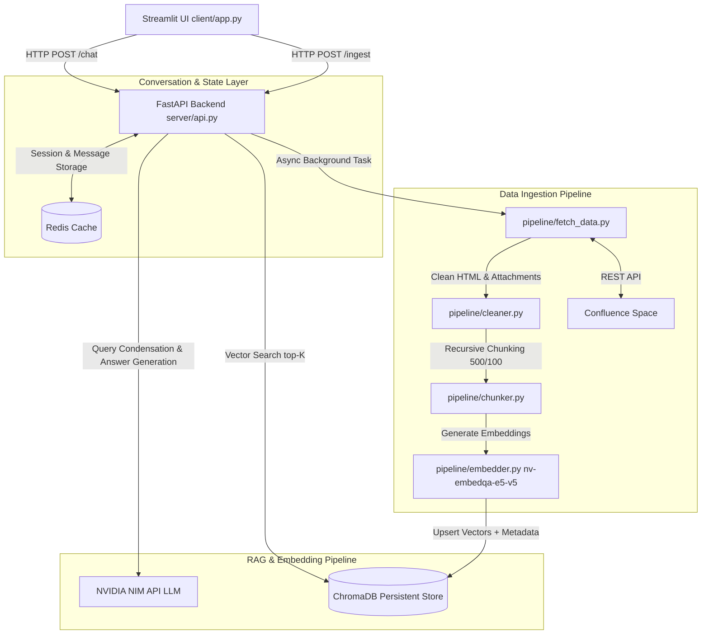

# Confluence RAG Chatbot

An enterprise-grade Retrieval-Augmented Generation (RAG) chatbot designed to ingest, chunk, embed, and query Atlassian Confluence spaces with clickable source citations, history-aware follow-up query condensation, and prompt-injection guardrails.

---

## 🏗️ Architecture



### Layer Walkthrough
1. **Frontend**: Built with Streamlit (`client/app.py`), providing multi-session chat, Confluence credential input, ingestion triggers, and clickable source links opening directly in new browser tabs.
2. **API Server**: Fast, async FastAPI backend (`server/api.py`) exposing chat, session management, and ingestion endpoints.
3. **Session Store**: Managed via Redis (`server/redis_service.py`), storing multi-turn user/assistant chat turns with 7-day TTL and session management capabilities.
4. **Ingestion & Vector Pipeline**: Confluence pages, attachments (PDF, DOCX, CSV, JSON, HTML), and comments are fetched, sanitized, split using `RecursiveCharacterTextSplitter` (chunk size 500, overlap 100), embedded via NVIDIA `nv-embedqa-e5-v5`, and stored in per-user ChromaDB collections.
5. **RAG & Safeguards**: Incoming user messages are condensed using history via NVIDIA NIM API endpoints before vector retrieval, then grounded with guardrailed prompts against instruction injections.

---

## ⚡ Prerequisites

- **Python**: 3.10 or higher
- **Redis**: Local instance or Upstash Redis URL
- **NVIDIA NIM API Key**: Key for `integrate.api.nvidia.com`
- **Confluence Credentials**: Atlassian Base URL, Account Email, and API Token

---

## 🛠️ Setup & Environment Configuration

1. **Clone Repository & Install Dependencies**:
   ```bash
   git clone <repo-url>
   cd Confluence-Chatbot
   python -m venv venv
   # On Windows PowerShell:
   .\venv\Scripts\Activate.ps1
   # On Linux/macOS:
   # source venv/bin/activate
   pip install -r requirements.txt
   ```

2. **Environment Variables**:
   Create a `.env` file in the root directory (refer to `.env_example`):
   ```ini
   # NVIDIA API Configuration
   NVIDIA_API_KEY=nvapi-your-key-here
   EMBEDDING_MODEL=nvidia/nv-embedqa-e5-v5
   LLM_MODEL=nvidia/mistral-nemo-12b-instruct

   # Redis Configuration
   REDIS_HOST=localhost
   REDIS_PORT=6379
   REDIS_URL=redis://:password@localhost:6379/0
   # Alternatively:
   # REDIS_PASS=

   # Client Configuration
   BACKEND_URL=http://127.0.0.1:8000
   ```

---

## 🚀 Running Locally

1. **Start FastAPI Backend**:
   ```bash
   uvicorn server.api:app --reload --host 127.0.0.1 --port 8000
   ```

2. **Start Streamlit Frontend**:
   ```bash
   streamlit run client/app.py
   ```

3. **Trigger Ingestion via curl (Optional)**:
   ```bash
   curl -X POST http://127.0.0.1:8000/ingest \
     -H "Content-Type: application/json" \
     -d '{
       "user_id": "demo-user",
       "api_key": "YOUR_CONFLUENCE_API_TOKEN",
       "user_email": "user@example.com",
       "confluence_url": "https://your-domain.atlassian.net/wiki"
     }'
   ```

---

## 📡 API Reference

| Endpoint | Method | Description | Request Example |
| :--- | :--- | :--- | :--- |
| `/chat` | `POST` | Process chat query with history condensation & RAG grounding | `{"user_id": "demo", "query": "What is project X?", "session_id": "optional-uuid"}` |
| `/ingest` | `POST` | Trigger async background ingestion of Confluence space | `{"user_id": "demo", "api_key": "...", "user_email": "...", "confluence_url": "..."}` |
| `/sessions/{user_id}` | `GET` | List all sessions for user sorted by `updated_at` | Header/URL param |
| `/sessions/{user_id}/{session_id}` | `GET` | Retrieve full chat history for session | Header/URL param |
| `/sessions/{user_id}/{session_id}` | `DELETE` | Delete a specific chat session | Header/URL param |
| `/sessions/{session_id}/clear` | `POST` | Clear message history in a session | Header/URL param |

### Chat Response Model (`POST /chat`)
```json
{
  "user_id": "demo-user",
  "session_id": "3a7b9f81-2c1a-4f5e-b921-827361a91e5d",
  "query": "elaborate on point 2",
  "answer": "Point 2 refers to...",
  "sources": [
    {
      "title": "Project Architecture Overview",
      "url": "https://your-domain.atlassian.net/wiki/spaces/DEV/pages/102938/Architecture",
      "page_id": "102938"
    }
  ]
}
```

---

## 📂 Project Structure

```
Confluence-Chatbot/
├── client/
│   └── app.py                # Streamlit UI application with session management & source links
├── server/
│   ├── api.py                # FastAPI endpoints, RAG pipeline, & query condensation
│   ├── config.py             # Shared environment configurations & NVIDIA client setup
│   ├── ingestion.py          # Ingestion orchestration pipeline runner
│   ├── models.py             # Pydantic data schemas for session metadata & messages
│   ├── prompts.py            # Guardrailed system prompt templates
│   ├── redis_client.py       # Redis client instance manager
│   └── redis_service.py      # Async Redis history and session persistence layer
├── pipeline/
│   ├── chroma_query.py       # Vector querying helper
│   ├── chroma_upsert.py      # ChromaDB collection vector upsert handler
│   ├── chunker.py            # Text chunking logic with metadata tagging
│   ├── cleaner.py            # HTML sanitization & document formatting
│   ├── embedder.py           # NVIDIA embedding API batch processor
│   ├── fetch_data.py         # Confluence REST API scraper & attachment fetcher
│   └── validate.py           # Pydantic schema validation for ingested pages
├── chroma_db/                # Local persistent Chroma vector database
├── .env                      # Local environment configurations (git-ignored)
├── requirements.txt          # Python dependencies
└── README.md                 # Project documentation
```

---

## ⚙️ Key System Specifications

- **Chunking Strategy**: `RecursiveCharacterTextSplitter` (size = 500 characters, overlap = 100 characters).
- **Retrieval**: Top-K = 10 similarity search vectors per query from user-specific ChromaDB collection.
- **Session Expiry**: Redis keys auto-expire after 7 days (`TTL = 604800` seconds).
- **Supported File Formats**: Confluence HTML page body, PDF, DOCX, CSV, JSON, TXT.

---

## 🗺️ Known Limitations & Roadmap

- **Incremental Sync**: Current ingestion syncs full space/pages matching filters. Incremental sync based on `updated_at` timestamps is planned.
- **Role-Based Access Control (RBAC)**: Enforce space/page permission filtering per user level.
- **Ingestion Progress Streaming**: Websocket or SSE endpoint to stream live page ingestion metrics to the Streamlit UI.
